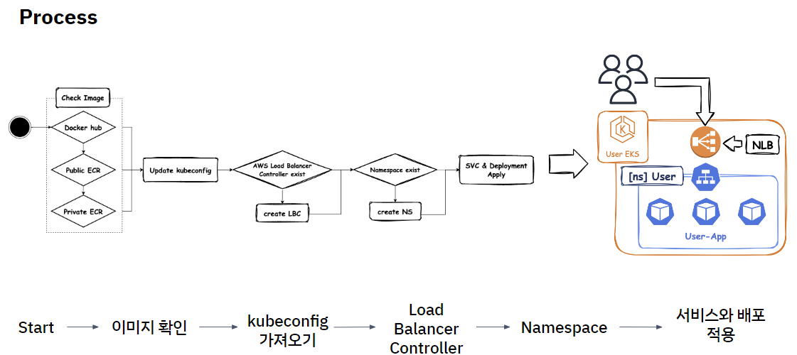

# 🚀 애플리케이션 배포 자동화 기능

이 저장소는 제가 **담당한 기능**인 **애플리케이션 배포 자동화** 코드만 포함하고 있습니다.  
해당 기능은 AWS 기반 인프라 프로비저닝과 애플리케이션 배포 통합 웹 서비스 개발 프로젝트에서 구현되었습니다.

---

## 🏆 주요 성과
- YAML 기반 입력만으로 배포 자동화 구현 → 배포 효율성 및 일관성 향상
- Shell Script를 활용해 인프라 프로비저닝과 배포 기능 자동화 → 수동 오타 및 설정 실수 최소화
- 중단 시 자동 롤백 기능 제공 → 안정적인 시스템 운영 보장

---

## 🧰 사용 기술

- 💻 Shell Script
- ☁️ AWS EKS, AWS ECR, AWS LBC
- ⚙️ Jenkins

---

## ⚙️ 기능 상세 구현

1. **이미지 검증**: Docker Hub, AWS Public/Private ECR에서 배포 이미지 사전 확인  
2. **kubeconfig 설정**: AWS EKS 환경 자동 구성  
3. **AWS Load Balancer Controller 설치 및 설정**: NLB(Network Load Balancer) 구성으로 외부 접근 가능  
4. **Namespace, Service, Deployment 생성**: 애플리케이션 배포 환경 구성  
5. **오류 처리 및 롤백**: 배포 중 오류 발생 시 자동 롤백

---

## 🔄 CI/CD 적용
- **CI:** GitHub Webhook → Jenkins 연결 → Script 파일 Docker Image 빌드 → ECR 업로드  
- **CD:** 배포 후 실시간 모니터링 및 검증 수동 진행
